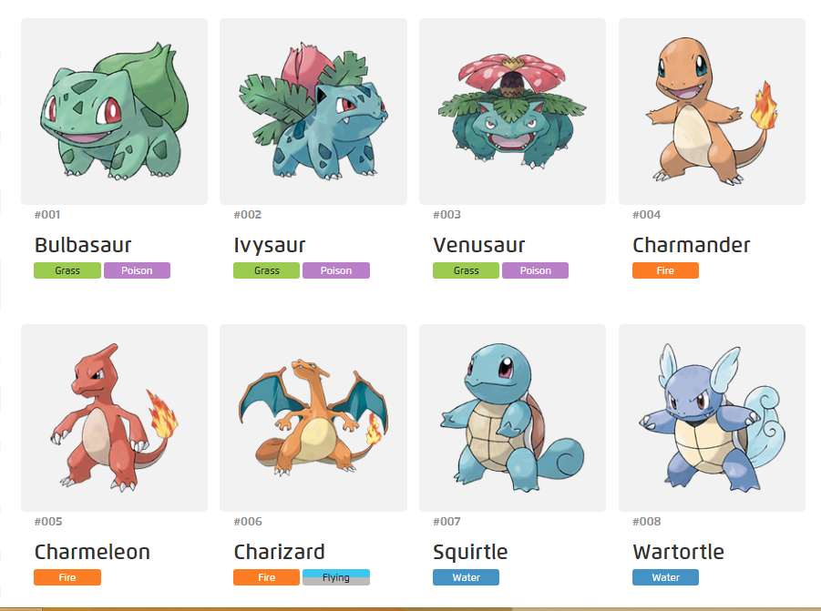
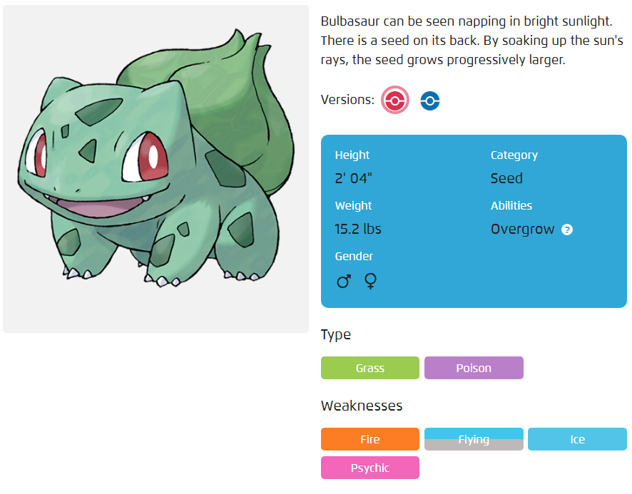
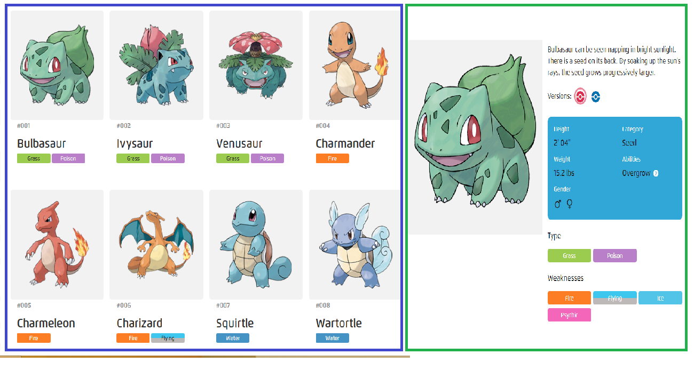

# Parcial 2


## Instrucciones Generales

- Haga un fork de este reposiorio. [Como hacer un fork](https://frontendlabs.io/3266--que-es-hacer-fork-repositorio-y-como-hacer-un-fork-github)
- Clone el repositorio en su máquina local
- Instale las dependencias con npm install

**MUY IMPORTANTE**
Durante el desarrollo del taller, no olvide ir salvando los cambios periódicamente (commit y push).

## Enunciado del parcial

Se debe desarrollar una aplicación que permita visualizar los pokemons en una galería. La aplicación debe tener:

### PUNTO 1 (40%)
1. Una clase Pokemon que permita gestionar todos los atributos presentados en la URL1. (10%)
2. Un servicio que utiliza http para obtener de la URL1 el conjunto de pokemons disponibles. (15%)
3. Un componente listar que presentará los pokemons en una galería. (15%) El componente lista ya está creado con una información estática, usted debe reorganizar el template para que permita el despliegue dinámico de los pokemons que vienen de la URL1.

**MUY IMPORTANTE**
El resultado final debe verse lo más parecido a la Fig. 1



### PUNTO 2 (40%)

Implemente un componente de detalle de pokemon, de tal forma que desde la galería de los pokemons, cuando el usuario haga click en un elemento se muestre la información del detalle. Para ello:

1. Cree un componente Detalle de Pokemon, que, haciendo uso de la clase y el servicio previamente construido, presente los datos del pokemon 
(name, weakness, abilities, number,height, category, weight, image ). El resultado final debe verse lo más parecido a 
. Para este punto haga uso del componente card

**MUY IMPORTANTE**
El despligue debe hacerse con el selector del componente detalle dentro del componente listar. El resultado final debe verse lo más parecido a la Fig. 2 y Fig 3.






### PUNTO 3 (10%)
Implemente un componente con un mensaje de error que debe aparecer cuando el usuario digite una ruta en el browser que no existe. Mensaje de ejemplo: "Contenido no encontrado". 

Ej: http://localhost:4200/asdsadsadqwe => Despliega componente con mensaje de error.

### PUNTO 4 (10%)
Implemente un filtro en el componente listar que permita ordernar los pokemons de forma ascendente y descendente según el atributo *id* de cada pokemon.

### Recursos

**URL1** https://gist.githubusercontent.com/jhonatan89/578ecc19d13842fc2b9f5cea2a2807df/raw/d75ece332beb70361a249b9d9a94eec104f8a33c/pokemons.json
Ejemplo:
```javascript
[ 
  {
    "abilities": [
      "Intrepid Sword"
    ],
    "detailPageURL": "/us/pokedex/Bulbasaur",
    "weight": 242.5,
    "weakness": [
      "Steel",
      "Poison"
    ],
    "number": "888",
    "height": 110,
    "collectibles_slug": "Bulbasaur",
    "featured": "true",
    "slug": "Bulbasaur",
    "name": "Bulbasaur",
    "ThumbnailAltText": "Bulbasaur",
    "ThumbnailImage": "https://assets.pokemon.com/assets/cms2/img/pokedex/detail/888.png",
    "id": 888,
    "type": [
      "fairy"
    ]
  }
]
```


### Instrucciones para la entrega del parcial

1. Haga commit y push a su repositorio
2. Haga un release con la etiqueta Parcial2Seccion3LoginUniandes
3. Suba como respuesta a la actividad de Sicua el zip del release.(Sólo se tendrá en cuenta el relase creado y adjuntado en Sicua)


Éxitos totales.

Jhonatan A
